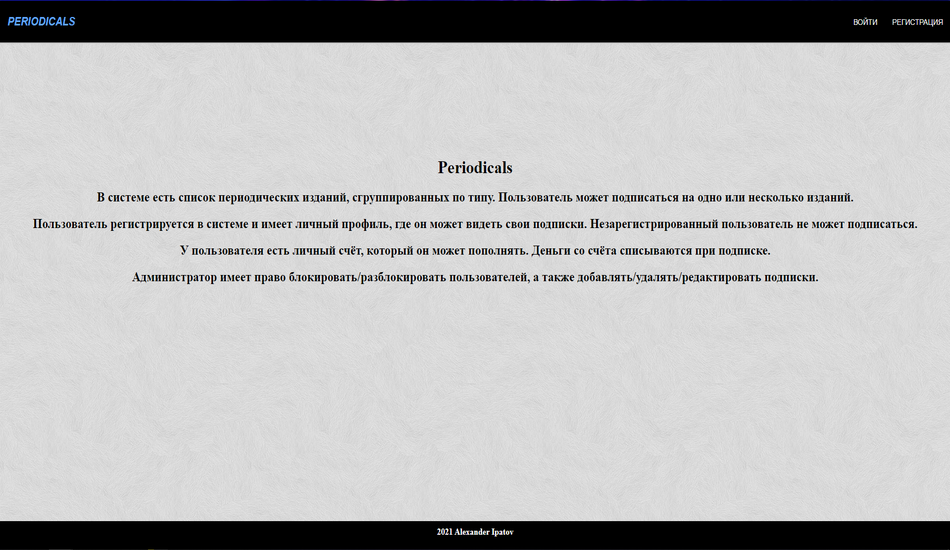
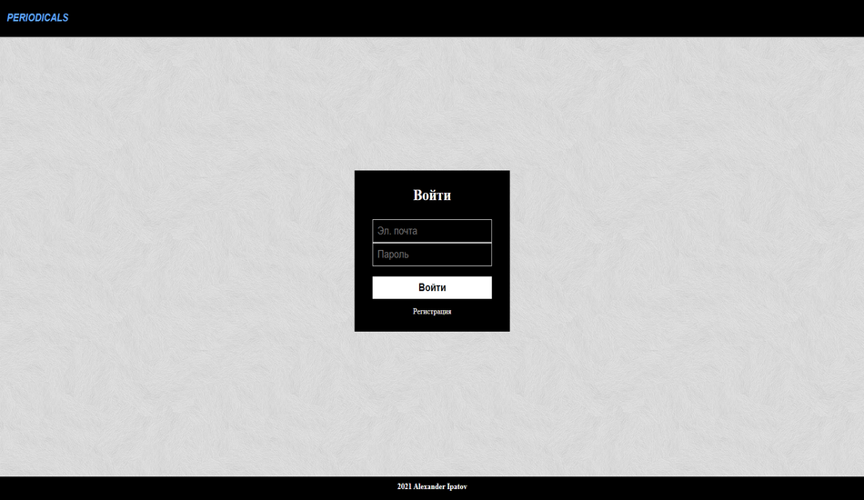
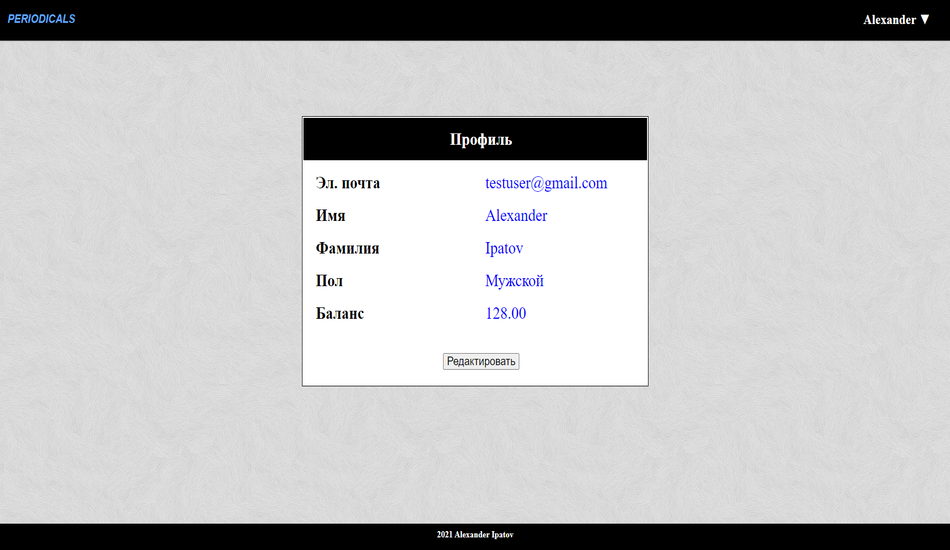
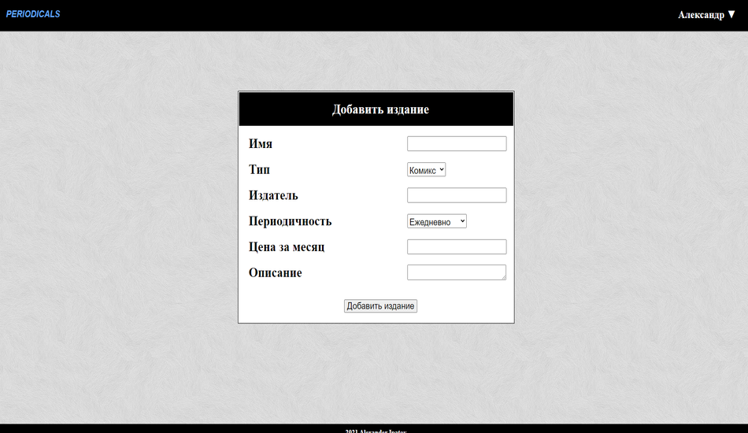

# Periodicals

## Описание проекта:

Реализовать работу системы Периодические издания. В системе существует перечень изданий, которые сгруппированы по типу.
Читатель может оформить подписку на одно или несколько изданий. Для изданий необходимо реализовать возможность:
- сортировка изданий по названию;
- сортировка изданий по цене;
- выборки изданий по определенной теме;
- поиска изданий по названию.

Читатель регистрируется в системе и имеет личный кабинет, в котором отражена информация о изданиях, на которые он подписан. Незарегистрированный пользователь не может оформить подписку.
Читатель имеет персональный счёт, который он может пополнить. Средства со счета снимаются во время подписки на издание.
Администратор системы обладает правами:
- добавление, удаление и редактирование издания;
- блокировка, разблокировка пользователя.

## Инструкции по установке:

1. Скачать или клонировать проект с репозитория.
2. Установить:
- Java SE 8 или новее
- Apache Tomcat 9
- MySQL Server 8
- Maven

## Инструкции по запуску:

1. В MySQL создать базу данных и сгенерировать начальные данные с помощью скриптов dbcreate.sql, dbdata.sql.
2. Для досупа приложения к базе данных в файле META_INF/context.xml вставить свой логин, пароль напротив полей username и password;
3. Запустить Tomcat.
4. В корневой папке проекта выполнить mvn tomcat7:deploy (или mvn tomcat7:redeploy, если Tomcat уже имеет war-файл в исходной директории);
5. В браузере перейти по ссылке: http://localhost:8080/periodicals/

## Схема базы данных

## Интерфейс

